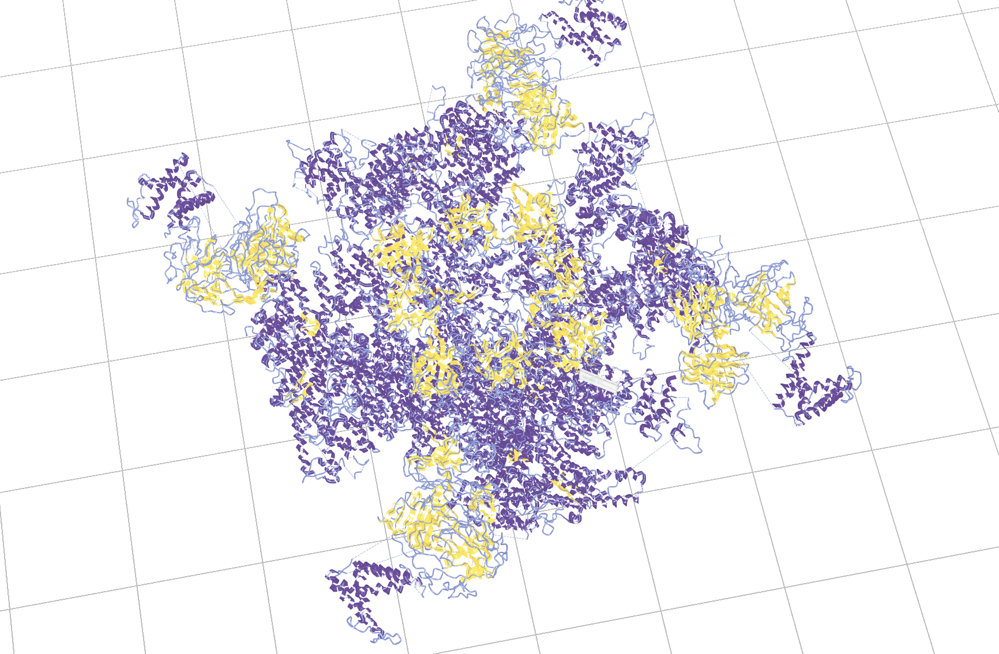
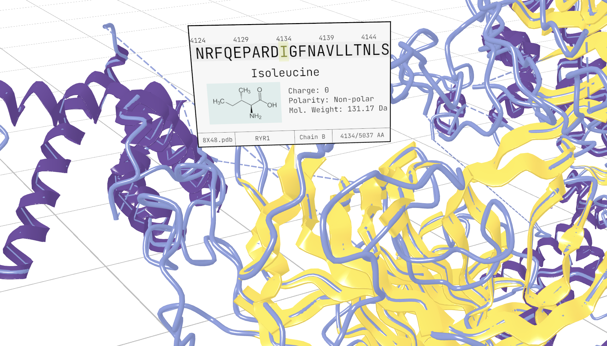

# Poke a Protein: Spatial Protein Explorer

A prototype XR view of the massive RYR1 protein, viewable in VR via WebXR and Three.js.

## What it does
Our prototype places a massive protein in VR and exposes this to a shared virtual environment where users of the Logitech MX Ink pen can interact with protein and see metadata related to sequences for collaborative analysis and sensemaking. We currently use a prototype interface with mockups containing real amino acid data. For example, when you're looking at a binding pocket, being able to tap each residue lining that pocket and see its properties (residue #, chain #, charge, polarity, size) helps you reason about what kind of ligand might fit. 

## How we built it
We used the Stylus’s WebXR capability with [Three.js](https://threejs.org/) based project. [Brahma.js](https://github.com/smrghsh/brahma) open source library to provide spatial locomotion techniques, shared user interfaces, and avatar embodiment. We integrated existing bioinformatics techniques for DSSP, letting us map the protein. The protein is really massive, so we had to create custom rendering techniques. We assigned secondary structure algorithms to replace subjective, manual interpretation and enable accurate, standardized comparisons of structures. We also had to perform bioinformatics processes to specify missing residues from within the source protein database file.

## Local Development
`npm install`
and 
`npm run dev`

## Build
Due to an old quirk of GitHub Pages, it currently builds to the `/docs` folder. Build with `npm run build`

## Source
[RYR1 Protein from RCSB](https://www.rcsb.org/structure/8X48)
